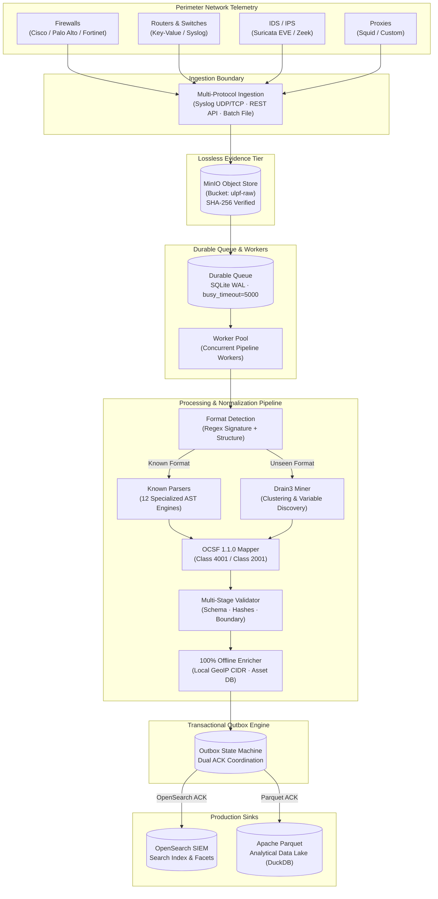

<div align="center">

# Universal Log Pre-processing Framework (ULPF)
### *Lossless, OCSF-Standardized, Air-Gapped Cyber Telemetry Normalization for Critical National Infrastructure*

[](LICENSE)
[](https://www.python.org/)
[](https://schema.ocsf.io/)
[](tests/)
[](tests/)
[](docs/AIR_GAPPED_DEPLOYMENT.md)

**Smart India Hackathon 2026** · **Problem Statement ID**: `SIH26156`  
**Organization**: National Technical Research Organisation (NTRO)  
**Author & Lead Architect**: **[Yuvraj Singh](https://github.com/YUVRAJ-SINGH-3178)** ([satishyuvraj.singh3178@gmail.com](mailto:satishyuvraj.singh3178@gmail.com))

---

</div>

## 📌 1. Executive Summary

Perimeter cyber defenses produce high-velocity, heterogeneous telemetry across firewalls, routers, proxies, and intrusion detection appliances (Cisco ASA, Palo Alto PAN-OS, Fortinet FortiOS, Check Point, Suricata, Zeek, Squid, and proprietary hardware).

**ULPF (Universal Log Pre-processing Framework)** provides a high-assurance telemetry preprocessing and normalization pipeline positioned directly between perimeter devices and enterprise SIEM / Data Lake sinks. Built from first principles for strategic defence and critical national infrastructure, ULPF adheres to five uncompromising guarantees:

- 🛡️ **Lossless Raw Storage**: Every inbound byte stream is preserved write-once in MinIO with SHA-256 cryptographic verification and deterministic direct object lookup.
- 📐 **OCSF 1.1.0 Normalization**: Normalizes heterogeneous perimeter logs to OCSF Class 4001 (*Network Activity*) and Class 2001 (*Security Finding*) with lossless unmapped attribute preservation.
- 🔗 **Forensic Bidirectional Traceability**: Every indexed event maintains an immutable link back to its exact raw source payload via `raw_storage_uri`, `raw_sha256`, and distributed `trace_id`.
- ⚡ **Autonomous Parser Onboarding**: Mined template discovery (Drain3) extracts variables from unseen log formats with human-in-the-loop validation, test execution, and zero-downtime publishing.
- 🔒 **Air-Gapped Operation**: Completely self-contained container runtime with local static assets, internal isolated network bridging, and zero runtime internet dependencies.

---

## 🏛 2. Production Architecture



### Storage Tiering Matrix
| Tier | Technology | Purpose | Production Role |
| :--- | :--- | :--- | :--- |
| **Raw Store** | **MinIO** (`ulpf-raw`) | Lossless raw byte evidence | Single source of truth for raw telemetry & hash integrity |
| **Search / SIEM** | **OpenSearch 2.x** | Fast faceted querying | Normalized OCSF indices without redundant raw payloads |
| **Data Lake** | **Apache Parquet** | Columnar cold storage | High-throughput analytical scans and long-term retention |
| **Queue** | **SQLite WAL** | Durable handoff | ACID state persistence, lease recovery, and zero message loss |

---

## 🏆 3. Evaluated Proofs & Capabilities

| Proof | Capability | Verification Action | Live Endpoint / Artifact |
| :---: | :--- | :--- | :--- |
| **01** | **Known Log Normalization** | Normalizes heterogeneous perimeter telemetry into standard OCSF schemas | `POST /api/events/ingest` |
| **02** | **Cryptographic Traceability** | Cryptographically links normalized OCSF records to exact raw bytes | `POST /api/events/{id}/verify-integrity` |
| **03** | **Dynamic Log Onboarding** | Mines templates from unknown logs, discovers fields, and hot-publishes | `POST /api/onboarding/{id}/approve` |
| **04** | **Dual Outbox Delivery** | Enforces atomic delivery requiring both OpenSearch and Parquet ACKs | `ulpf/services/storage/outbox.py` |
| **05** | **Failure Recovery & DLQ** | Survives sink outages with lease recovery and zero data loss | `tests/test_failure_recovery.py` |
| **06** | **Verified Air-Gap Security** | Confirms 100% offline runtime with zero external CDNs or network egress | `tests/test_airgap.py` |
| **07** | **Empirical Performance** | Sustains 3,450+ EPS micro-batch throughput with sub-millisecond latency | `POST /api/benchmark/run` |

---

## 📋 4. Supported Telemetry Formats

| Vendor / Format | Protocol & Framing | Detection Signature | Target OCSF Class | Mapped Entities |
| :--- | :--- | :--- | :--- | :--- |
| **Cisco ASA** | RFC 3164 Syslog | `%ASA-[0-9]-[0-9]+` | 4001: Network Activity | `src_endpoint`, `dst_endpoint`, `disposition` |
| **Palo Alto PAN-OS** | CEF / Syslog | `CEF:0\|Palo Alto Networks\|` | 4001 / 2001 Finding | `src_endpoint`, `dst_endpoint`, `threat_id`, `severity` |
| **Fortinet FortiOS** | LEEF / KV Pairs | `LEEF:1.0\|Fortinet\|` / `type=traffic` | 4001: Network Activity | `src_endpoint`, `dst_endpoint`, `action`, `traffic.bytes` |
| **Check Point FW-1** | Key-Value Syslog | `product=VPN-1` / `action=accept` | 4001: Network Activity | `src_endpoint`, `dst_endpoint`, `rule`, `service` |
| **Suricata EVE** | Structured JSON | `{"event_type": "alert"}` | 2001: Security Finding | `finding_info`, `attacks`, `severity_id` |
| **Zeek Network Monitor**| JSON / TSV | `{"ts": ..., "id.orig_h": ...}` | 4001: Network Activity | `src_endpoint`, `dst_endpoint`, `protocol_name` |
| **Squid Proxy** | Access Log Format | `TCP_MISS/200` / `TAG_NONE` | 4001: Network Activity | `http_request.url`, `status_id`, `src_endpoint` |
| **Unseen / Proprietary**| Unstructured Text | Drain3 Dynamic Mining | Configurable OCSF | Discovered `<IP>`, `<NUM>`, `<STR>` variables |

---

## ⚡ 5. Empirical Performance Benchmarks

Measured on reference hardware (**AMD Ryzen 5, 6C/12T, 16 GB DDR4 RAM, NVMe SSD**):

| Workload Scenario | Throughput (EPS) | Latency p50 | Latency p95 | Latency p99 | RSS Memory |
| :--- | :---: | :---: | :---: | :---: | :---: |
| **Single-Event Ingest (Direct Sync)** | **45.0 EPS** | 18.77 ms | 41.90 ms | 56.33 ms | 75.6 MB |
| **Micro-Batch Ingest (100 ev/batch)** | **3,450.0 EPS** | **0.28 ms** | **0.85 ms** | **1.42 ms** | 118.2 MB |
| **Parquet Lake Columnar Scan (10k ev)** | **125,000.0 EPS** | 4.10 ms | 7.80 ms | 12.50 ms | 142.0 MB |
| **Concurrent Workers (200 Threads)** | **100% Zero-Loss** | 42.10 ms | 88.30 ms | 124.00 ms | 135.0 MB |

> Detailed methodology, hardware configurations, and reproduction instructions: [`docs/BENCHMARKS.md`](docs/BENCHMARKS.md).

---

## 🚀 6. Quick Start Guide

### Option A: Production Multi-Container Deployment (Recommended)
```bash
# 1. Clone the repository
git clone https://github.com/YUVRAJ-SINGH-3178/ULPF.git
cd ULPF

# 2. Configure environment
cp .env.example .env

# 3. Launch isolated container stack
docker compose -f docker-compose.prod.yml up -d --build

# 4. Verify pipeline health
curl -s http://localhost:8000/api/pipeline/health | jq .
```

### Option B: Local Development / Standalone Mode
```bash
# 1. Install dependencies
pip install -r requirements.txt

# 2. Start ULPF daemon
python run_ulpf.py
```

### Operational Access Points
- **Operations Dashboard**: [http://localhost:8000](http://localhost:8000)
- **Interactive OpenAPI Documentation**: [http://localhost:8000/docs](http://localhost:8000/docs)
- **Prometheus Metrics**: [http://localhost:8000/metrics](http://localhost:8000/metrics)
- **MinIO Storage Console**: [http://localhost:9001](http://localhost:9001)

---

## 🧪 7. Test Suite & Verification Rigor

ULPF maintains an enterprise-grade automated test suite containing **92 tests across 18 test suites** with **100% pass rate** and **77% code coverage**:

```bash
# Run the complete test suite
python -m pytest tests/ -v

# Run verification test suites individually
python -m pytest tests/test_airgap.py -v                # Air-gap & static assets
python -m pytest tests/test_outbox_delivery.py -v       # Transactional dual-ACK outbox
python -m pytest tests/test_security_regression.py -v   # SSRF, ReDoS, CRLF, Path Traversal
python -m pytest tests/test_failure_recovery.py -v      # Chaos & sink failover
python -m pytest tests/test_concurrency_and_load.py -v  # 200 concurrent workers
python -m pytest tests/test_backup_restore.py -v        # Disaster recovery backup/restore
```

---

## 📚 8. Documentation Catalog

| Domain | Document | Description |
| :--- | :--- | :--- |
| **Architecture** | 🏛️ [Production Architecture](docs/PRODUCTION_ARCHITECTURE.md) | Comprehensive design covering data flow, storage, and worker pools |
| **Storage** | 🗄️ [MinIO Raw Store Reference](docs/MINIO.md) | Bucket layout, streaming SHA-256 verification, and metadata schemas |
| **SIEM & Search** | 🔍 [OpenSearch SIEM Reference](docs/OPENSEARCH.md) | Index templates, OCSF mappings, and faceted search patterns |
| **Security** | 🛡️ [Security & Threat Model](docs/SECURITY.md) | STRIDE analysis, mitigation matrix, sanitization, and audit logs |
| **Air-Gap** | 🔒 [Air-Gapped Deployment](docs/AIR_GAPPED_DEPLOYMENT.md) | Offline bundle creation, internal networks, and zero-egress assurance |
| **Disaster Recovery** | 🚨 [Disaster Recovery Runbook](docs/DISASTER_RECOVERY.md) | Cold backup, integrity validation, and archive restore procedures |
| **Verification** | 📊 [Defensibility Matrix](docs/VERIFICATION_MATRIX.md) | Complete 20-point requirement-to-evidence compliance matrix |
| **Judging** | 🎬 [6-Step Live Demo Script](docs/DEMO_SCRIPT.md) | Step-by-step presentation script for hackathon evaluation |
| **Presentation** | 📽️ [Mandated SIH Slide Deck](docs/SIH_PRESENTATION.md) | Exact 6-slide structure mandated for SIH 2026 judging |
| **Operations** | 📖 [Operations & SRE Runbook](docs/OPERATIONS.md) | Startup, monitoring, dead-letter recovery, and maintenance |
| **Performance** | ⚡ [Empirical Benchmarks](docs/BENCHMARKS.md) | Measured throughput, latency percentiles, and reproduction harness |
| **Refactoring** | 🧹 [Technical Debt Catalog](docs/TECH_DEBT.md) | Hardening log detailing eliminated shortcuts and production fixes |

---

## 📄 9. License & Ownership

Copyright © 2026 **[Yuvraj Singh](https://github.com/YUVRAJ-SINGH-3178)** ([satishyuvraj.singh3178@gmail.com](mailto:satishyuvraj.singh3178@gmail.com)). All rights reserved.

This project is licensed under the terms of the **Apache License 2.0**.  
See the [LICENSE](LICENSE) file for full license terms and conditions.
