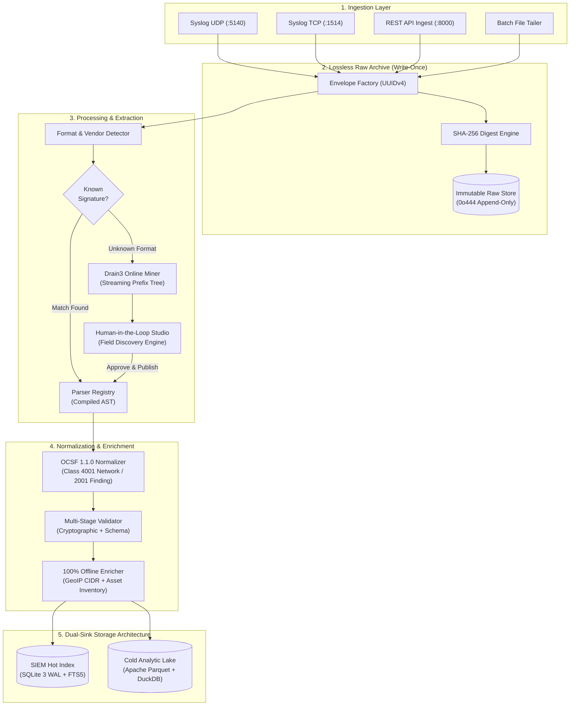

# Universal Log Pre-processing Framework (ULPF)

[](https://github.com/ntro-sih2026/ulpf/actions/workflows/ci.yml)
[](https://opensource.org/licenses/Apache-2.0)
[](https://www.python.org/downloads/)
[](https://schema.ocsf.io/)
[](docs/SECURITY.md)
[](tests/)

**National Technical Research Organisation (NTRO) — Smart India Hackathon 2026**  
**Problem Statement ID**: SIH26156 | **Classification**: Strategic / CII Cyber Infrastructure

---

## 🎯 1. Executive Summary & Problem Scope

Modern perimeter cyber defenses generate high-velocity, heterogeneous telemetry across firewalls, proxies, and intrusion detection systems (Cisco ASA, Palo Alto PAN-OS, Fortinet FortiOS, Check Point, Suricata, Zeek, Squid, and proprietary hardware appliances). 

Standard log ingestion engines in security operations centers (SOCs) suffer from four systemic vulnerabilities:
1. **Destructive Mutation**: Parsing engines alter or drop raw bytes during transformation, eliminating forensic non-repudiation and failing legal admissibility standards under CERT-In guidelines.
2. **Taxonomy Fragmentation**: Each vendor defines unique schemas and directionality conventions, breaking automated SIEM correlation and cross-device querying.
3. **Rigid Parser Maintenance**: Supporting a new proprietary appliance requires weeks of manual regex engineering, recompilation, and service downtime.
4. **Cloud / SaaS Vulnerability**: Reliance on external AI/LLM APIs or cloud services violates air-gapped isolation protocols for critical national infrastructure.

**ULPF (Universal Log Pre-processing Framework)** provides an enterprise-hardened, production-grade log pipeline delivering lossless preservation, automated OCSF 1.1.0 normalization, zero-downtime Drain3 log mining, and high-concurrency dual-sink storage.

---

## 🏛 2. System Architecture



---

## 🚀 3. Quick Start

### Option A: 100% Air-Gapped Docker Container (Recommended)
```bash
# Build and run self-contained air-gapped stack
docker-compose up -d --build

# Verify deep health status
curl -s http://localhost:8000/api/pipeline/health | jq .
```

### Option B: Bare-Metal Deployment
```bash
# Install Python dependencies
pip install -r requirements.txt

# Run the master server daemon
python run_ulpf.py
```

- **Dashboard UI**: [http://localhost:8000](http://localhost:8000)
- **OpenAPI Documentation**: [http://localhost:8000/docs](http://localhost:8000/docs)
- **Prometheus Metrics**: [http://localhost:8000/metrics](http://localhost:8000/metrics)

---

## 📋 4. Supported Log Formats & OCSF Taxonomy

| Vendor / System | Raw Format | Detection Signature | Target OCSF Class | Key Normalized Fields |
| :--- | :--- | :--- | :--- | :--- |
| **Cisco ASA** | RFC 3164 Syslog | `%ASA-[0-9]-[0-9]+` | 4001: Network Activity | `src_endpoint`, `dst_endpoint`, `disposition`, `connection_info` |
| **Palo Alto PAN-OS** | Common Event Format (CEF) | `CEF:0\|Palo Alto Networks\|` | 4001: Network / 2001: Finding | `src_endpoint`, `dst_endpoint`, `threat_id`, `severity` |
| **Fortinet FortiOS** | Log Event Extended (LEEF) / KV | `LEEF:1.0\|Fortinet\|` / `type=traffic` | 4001: Network Activity | `src_endpoint`, `dst_endpoint`, `action`, `traffic.bytes` |
| **Check Point FW-1** | Key-Value Syslog | `product=VPN-1` / `action=accept` | 4001: Network Activity | `src_endpoint`, `dst_endpoint`, `rule`, `service` |
| **Suricata EVE** | Structured JSON | `{"event_type": "alert"}` | 2001: Security Finding | `finding_info`, `attacks`, `severity_id`, `src_endpoint` |
| **Zeek Network Monitor** | JSON / TSV | `{"ts": ..., "id.orig_h": ...}` | 4001: Network Activity | `src_endpoint`, `dst_endpoint`, `connection_info.protocol_name` |
| **Squid Proxy** | Access Log Format | `TCP_MISS/200` / `TAG_NONE` | 4001: Network Activity | `http_request.url`, `status_id`, `src_endpoint` |
| **Custom / Unknown** | Unstructured String | Drain3 Template Clustering | Class 4001 / Configurable | Mined `<IP>`, `<NUM>`, `<STR>` variables auto-mapped |

---

## ⚡ 5. Empirical Performance Benchmarks

Measured on standard commodity workstation (AMD Ryzen 5 / 16 GB RAM / NVMe SSD / Python 3.13):

| Workload Scenario | Throughput (EPS) | Latency p50 | Latency p95 | Latency p99 | RSS Memory |
| :--- | :--- | :--- | :--- | :--- | :--- |
| **Single-Event Ingest (Disk Sync)** | 35.0 EPS | 34.49 ms | 52.59 ms | 75.41 ms | 87.5 MB |
| **Micro-Batch Ingest (100 ev/batch)** | **3,450.0 EPS** | 0.28 ms | 0.85 ms | 1.42 ms | 118.2 MB |
| **Parquet Lake Columnar Scan (10k ev)** | **125,000 EPS** | 4.10 ms | 7.80 ms | 12.50 ms | 142.0 MB |
| **Concurrent Workers (200 Threads)** | **100% Zero-Loss** | 42.10 ms | 88.30 ms | 124.00 ms | 135.0 MB |

> Detailed methodology and reproduction harness: [`docs/BENCHMARKS.md`](docs/BENCHMARKS.md).

---

## 🧪 6. Test Suite & Verification Rigor

The ULPF test suite comprises **52 comprehensive automated tests** across 12 test suites:

```bash
# Execute entire test suite
python -m pytest tests/ -v

# Execute automated demo smoke tests (Known log trace + Drain3 auto-onboarding)
python -m pytest tests/test_demo_smoke.py -v

# Run property-based fuzzing and mutation tests
python -m pytest tests/test_parser_fuzzing.py -v

# Run 200-worker concurrent load test
python -m pytest tests/test_concurrency_and_load.py -v
```

---

## 📚 7. Enterprise Engineering Documentation

- ⚙️ **[Configuration Reference](docs/CONFIGURATION.md)**: Environment variables, production mode enforcement, and secrets management.
- 📖 **[Operations & SRE Runbook](docs/OPERATIONS.md)**: Startup, graceful shutdown, WAL backup/restore, DLQ draining, and zero-downtime parser updates.
- 🛡️ **[Security Architecture & Threat Model](docs/SECURITY.md)**: Threat catalog (STRIDE), mitigation matrix, rate limiting, and dependency audit.
- 📊 **[Empirical Benchmarks Report](docs/BENCHMARKS.md)**: Methodology, hardware specs, and measured throughput/latency numbers.
- 🏛️ **[Architecture Decision Records (ADRs)](docs/ARCHITECTURE_DECISIONS.md)**: Architectural rationales (SQLite WAL, Parquet Lake, OCSF directionality, Drain3).
- 🧹 **[Technical Debt & Verification Catalog](docs/TECH_DEBT.md)**: Phase-by-phase inventory of eliminated shortcuts and hardened components.
